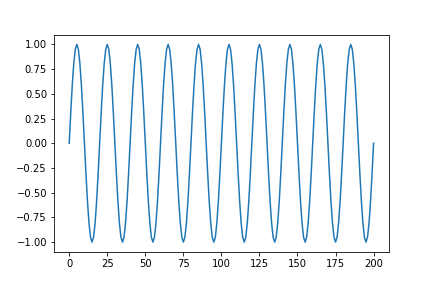

# Generating Audio

In this folder you will find some Python code (`generate_audio.py`) for generating audio. We first discuss some theory: (a) what is sound, and how might we represent it digitally, (b) sampling a wave form, (c) how to convert the samles to a `.wav` file that can be run through an audio player.


## Representing sound

The basic idea is as follows.  Sound waves are longitudinal waves of compression and rarefication of air pressure.  A graph of the air pressure *y(t)* at a fixed location might look like what you see in the figure below. We have graphed pressure versus time, where `y(t)` has the form = `A*sin(w*t)`, where *A* is the amplitude and *w* is the angular frequency.




To represent sound digitally, one first *samples* it, recording the values of *y(t)* at regular intervals.  The first seven samples might look like this:

```
   [0.0, 0.309, 0.588, 0.809, 0.951, 1.0, 0.951, ...]
```

Real-world sampling is done in a sequence of steps: a microphone converts pressure variations into voltage variations; an amplifier increases the amplitude of these variations; a sampler records the amplitude of the signal at regularly spaced intervals; the sampler, generating a stream of floating point numbers feeds the result to a digitizer, which produces a stream of bytes which are written to a file in an appropriate format.

Below we show how this entire process can be done in software.  We generate a waveform using a function like `A*sin(w*t)`, sample it algorithmically, convert the resulting array of floating point numbers to a byte sequence one element at a time, writing the result to a file in an appropriate format.

## Taking the samples

Code to take the samples is in the files `gen_sound.py` and `gen_sound2.py`

## Credits

The code in `gen_sound.py` (slightly) adapted from the example in th [wavio library](https://pypi.org/project/wavio/).

The code in `gen_sound1.py` is based on that described in the two articles below:

- [It is ridiculously easy to generate any audio signal using Python](https://thehackerdiary.wordpress.com/2017/06/09/it-is-ridiculously-easy-to-generate-any-audio-signal-using-python/) — by 153armstrong

- [Fastest way to generate WAV files in Python, using the wave module](https://soledadpenades.com/posts/2009/fastest-way-to-generate-wav-files-in-python-using-the-wave-module/) — by Soledad Penadés
